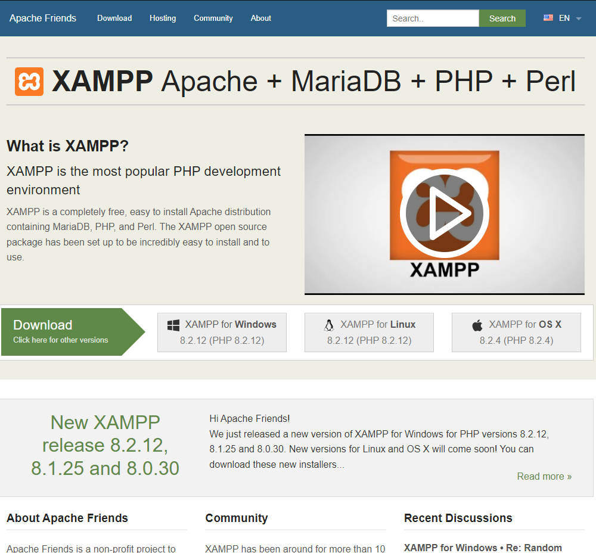

# Installing a local server with XAMPP

To install [Xampp](https://www.apachefriends.org/) local server.
or you can also download it from here: [xampp](https://www.apachefriends.org/download.html)

;
